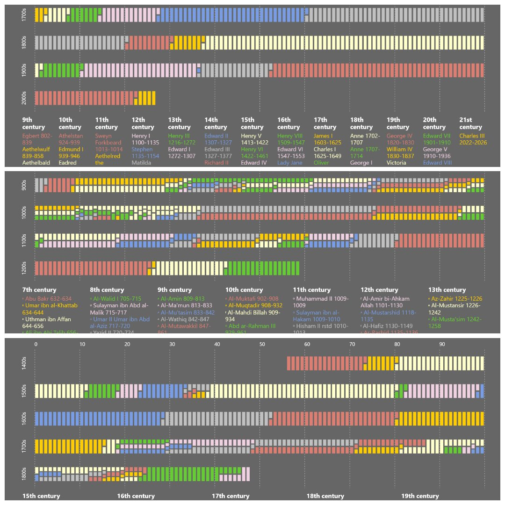

# Rulers of the Kazakh Khanate

[](https://witold1.github.io/rulers-of-kazakh-khanate/web/)


<p align="center">
  
</p>

Century × year tile chart of who ruled when: each year is a colored cell, empty years are gaps, and overlapping reigns become stacked stripes.

Two implementations live in this repo:

- **Python** (`notebooks/`) — original matplotlib chart from 2024, later refactored into the `rulers_chart` package and notebook
- **Interactive web tool** (`web/`) — browser version that should work with **any** reign-list TSV/CSV (map columns, title, sources, palette). Ships with Kazakh khans, caliphs, and English monarchs as presets

The matrix idea was inspired with [Barely Maps' Roman emperors chart](https://www.barelymaps.com/558tiziwfm675vxkeajhvu4oah7pdn) and generalized to various historical periods.

## Description

### 1. Chart

| Element | Meaning |
|---------|---------|
| Rows | Centuries (e.g. `1456` → 1400s row) |
| Columns | Year within the century (`1456` → column `56`) |
| Colored tiles | Years a ruler held power (end years inclusive) |
| Stacked stripes | Overlapping / contested reigns in the same year |
| Gaps | Power vacuum |

Hover a year for the readout and tooltip; click a legend entry to highlight that ruler across the grid.

### 2. Controls

- **Theme** - light / dark (remembered in `localStorage`)
- **Presets** - Kazakh khans, Caliphs, English monarchs (from `data/presets.json`)
- **Upload your data** - map TSV/CSV columns (name, period, optional group / native name / note), set title & sources, pick a palette
- **Export** - download SVG or PNG poster via `html-to-image` (CDN)

## Data

Preset manifest: [`data/presets.json`](data/presets.json).

| Path | Contents |
|------|----------|
| `data/kazakh_khans.tsv` | Default dataset — name, ruling period, Kazakh name, note |
| `data/all_caliphs_timeline.tsv` | Caliphs — name, years, dynasty, death reason |
| `data/english_monarchs.csv` | English monarchs — name, period, dynasty |
| `data/caliphs_death_reasons.csv` | Working scrap (not wired into presets) |

Kazakh sources: [List of Kazakh khans](https://en.wikipedia.org/wiki/List_of_Kazakh_khans) and [Казахский хан](https://ru.wikipedia.org/wiki/%D0%9A%D0%B0%D0%B7%D0%B0%D1%85%D1%81%D0%BA%D0%B8%D0%B9_%D1%85%D0%B0%D0%BD). Other presets credit Wikipedia lists in the chart captions.

Unicode name prefixes in the khans TSV are category tags (`ᴭ` contested, `ᶬ` post-Tauke, juz markers, etc.) — kept in the name string for now.

## Run locally

JSON/TSV under `data/` is loaded over HTTP — open via a local server from the **repo root** (not as a raw `file://` page):

```powershell
python -m http.server 8080
```

Then open `http://localhost:8080/` (root `index.html` redirects to `web/`).

No bundler or package manager for the web app: ES modules and `fetch` for presets need HTTP.

### Python notebook / package

```powershell
uv sync
```

Open [`notebooks/kazakh-khans-by-year.ipynb`](notebooks/kazakh-khans-by-year.ipynb). It uses `notebooks/rulers_chart/` (`load_rulers`, `build_year_grid`, `plot_rulers`) and writes SVG/PNG under `notebooks/artifacts/`.

## Repository layout

```text
.
├── notebooks/              # Python version (refactored)
│   ├── kazakh-khans-by-year.ipynb
│   ├── rulers_chart/       # matplotlib module
│   │   ├── data.py
│   │   └── plot.py
│   └── artifacts/          # Saved SVG + PNG charts
├── web/                    # Browser app and tool version
│   ├── index.html
│   ├── css/
│   │   ├── tokens.css
│   │   ├── layout.css
│   │   └── export.css
│   └── js/
│       ├── app.js
│       ├── parse.js
│       ├── grid.js
│       ├── colors.js
│       ├── chart.js
│       ├── legend.js
│       ├── tooltip.js
│       └── export.js
└── index.html              # Workaround; Redirects root/ -> root/web/
├── data/                   # Shared datasets
│   ├── presets.json
│   ├── kazakh_khans.tsv
│   ├── all_caliphs_timeline.tsv
│   ├── english_monarchs.csv
│   └── caliphs_death_reasons.csv
```

## License & credit

| Part | License |
|------|---------|
| Code (`web/`, `notebooks/`) | [MIT](LICENSE) |
| Datasets under `data/` | [CC BY-SA 4.0](LICENSE-DATA) — Wikipedia-derived; see captions / `presets.json` |

_Made with AI. Curated by Human._
